# Work Contract: a practical introduction

Work Contract (WC) is a C++20 library for persistent, serialized activities that
are signaled cheaply and executed by application-owned workers.

A conventional task queue stores one callable for every occurrence of work. WC
stores the callable once and gives it a persistent identity. Other threads can
then signal that activity whenever it may have something to do. Repeated signals
coalesce while the activity is already pending or executing.

That distinction makes WC a particularly good fit for event-driven systems:

- a market-data instrument that drains its inbox when new updates arrive;
- an actor or state machine that runs when its state changes;
- a connection, device, or game entity with recurring work;
- a service loop that explicitly schedules its next step;
- work that must be pulled by application-owned threads with chosen affinity.

WC is not a thread pool and does not prescribe a worker topology. The application
decides which threads execute contracts, how many workers exist, whether idle
workers spin or park, and when the system stops.

## The idea in two minutes

This complete example creates one contract, runs it three times, and then
releases it:

```cpp
#include <library/work_contract.h>

#include <cstdint>
#include <iostream>
#include <thread>

int main()
{
    bcpp::work_contract_group group({.capacity_ = 64});
    std::uint64_t invocation = 0;

    auto heartbeat = group.create_contract(
        [&]
        {
            std::cout << "heartbeat " << ++invocation << '\n';

            if (invocation < 3)
                bcpp::this_contract::schedule();
            else
                bcpp::this_contract::release();
        },
        bcpp::work_contract::initial_state::scheduled);

    while (heartbeat.is_valid())
    {
        if (not group.execute_next_contract())
            std::this_thread::yield();
    }
}
```

The important pieces are:

1. `work_contract_group` stores callbacks and tracks which contracts are pending.
2. `create_contract` returns a movable `work_contract` handle.
3. `schedule()` makes an idle contract eligible to run.
4. `execute_next_contract()` selects one pending contract and invokes it on the
   calling thread.
5. While running, `this_contract` lets a callback schedule or release itself
   without capturing its handle.
6. Release is asynchronous: an executor observes the release request, invokes
   the optional release handler, destroys the stored callback, and recycles the
   slot.

The fourth executor action in the example processes release; it does not invoke
the callback a fourth time.

## The mental model

Think of a contract as a named, reusable coalescing notification target—not as a
queued task.

```text
                         schedule()
        ┌────────────────────────────────────────┐
        │                                        ▼
    unscheduled ── schedule ──► pending ── execute_next ──► executing
        ▲                              release ──►│    │
        │                                        │    ├─ schedule ─► one follow-up
        │                                        │    └─ release  ─► terminal follow-up
        └──────── callback remains installed ◄───┘

    pending release ── execute_next ──► callback destroyed, slot recycled
```

Scheduling is coalescing. Calling `schedule()` one hundred times before a worker
selects the contract still requests one execution. Calling it while the contract
is executing requests at most one follow-up execution.

This is a feature when the callback drains or reconciles state:

```text
producer writes state ─► producer schedules contract ─► contract observes/drains state
```

It is the wrong primitive when every signal must be counted and there is nowhere
else to store those events. In that case, put the events in a queue or counter
and use the contract as the coalescing notification that drains it.

## A realistic ingress pattern

This first ingress example deliberately uses a familiar mutex-backed inbox. It
keeps the focus on WC's role while preserving every message without allocating
one task per message:

```cpp
#include <library/work_contract.h>

#include <mutex>
#include <string>
#include <utility>
#include <vector>

struct inbox
{
    std::mutex mutex;
    std::vector<std::string> messages;
};

bcpp::work_contract_group group({.capacity_ = 512});
inbox pending;

auto consumer = group.create_contract(
    [&]
    {
        std::vector<std::string> batch;
        {
            std::lock_guard lock{pending.mutex};
            batch.swap(pending.messages);
        }

        for (auto & message : batch)
            process(message);
    });

void submit(std::string message)
{
    {
        std::lock_guard lock{pending.mutex};
        pending.messages.push_back(std::move(message));
    }
    consumer.schedule();
}
```

If ten producers submit concurrently, their messages remain in the inbox even
when their schedule requests coalesce. If a producer submits while the consumer
is executing, scheduling requests one follow-up pass. WC provides the wakeup and
per-contract execution serialization; the inbox supplies payload storage. The
producer publishes the message before scheduling the consumer.

This is the simplest correct shape, not the highest-performance topology. The
mutex protects multiple producers from one another; WC has already removed the
need to protect the callback from another invocation of itself.

### Preferred low-latency topology: SPSC edges

WC guarantees that two workers never execute the same contract concurrently.
The callback is therefore a single logical consumer even when successive
invocations run on different executor threads. Its private mutable state does
not need a mutex merely because the group has multiple workers.

For a low-latency work graph, the preferred ingress and egress path is one
bounded single-producer/single-consumer queue per directed edge:

```text
producer activity ── SPSC payload queue ──► consumer contract
        └────────────── schedule() ────────────────┘
```

In schematic C++—`spsc_queue` stands for the application's chosen SPSC ring:

```cpp
spsc_queue<std::string, 1024> ingress;

auto consumer = group.create_contract(
    [&]
    {
        std::string message;
        while (ingress.try_pop(message))
            process(message);
    });

bool submit(std::string message)
{
    if (not ingress.try_push(std::move(message)))
        return false; // apply the application's full-ring policy

    consumer.schedule();
    return true;
}
```

The queue preserves every accepted payload even when schedule requests coalesce.
If the producer pushes while the consumer is executing, scheduling records one
follow-up pass; that pass drains everything accumulated in the queue.

For a work graph, give each directed edge its own SPSC queue. A downstream
contract with several upstream producers can drain one SPSC queue per producer,
preserving SPSC behavior without introducing a contended MPSC structure. When
that topology is unsuitable, an MPSC queue or mutex-protected inbox remains
valid, but it gives up an important source of WC's single-threaded performance.

“Single-threaded execution” means non-overlap for one contract, not permanent
thread affinity. A callback may migrate between executor threads across
invocations. WC's state and signal handoffs order those invocations; resources
that specifically require thread affinity must still be assigned to an
application-controlled worker.

## Owning the workers

`execute_next_contract()` executes work synchronously on its caller. A group is
safe to drain from multiple threads, and a particular contract is serialized
even when several workers compete for work. Consequently, a contract's private
state and its side of an SPSC ingress/egress edge can use single-threaded access
patterns without internal locking.

### Non-blocking workers

The ordinary group returns `false` immediately when no signal is available:

```cpp
bcpp::work_contract_group group({.capacity_ = 4096});
std::atomic<bool> running{true};

std::vector<std::thread> workers;
for (unsigned index = 0; index < std::thread::hardware_concurrency(); ++index)
{
    workers.emplace_back(
        [&]
        {
            bcpp::signal_id hint{};
            while (running.load(std::memory_order_acquire))
            {
                if (not group.execute_next_contract(hint))
                    std::this_thread::yield(); // choose the backoff policy
            }
        });
}
```

This mode gives the application direct control over spinning, yielding, CPU
affinity, partitioning, and integration with another event loop.

### Blocking workers

A blocking group's no-timeout overload parks indefinitely while the group is
idle. Duration overloads provide a bounded wait:

```cpp
using namespace std::chrono_literals;

bcpp::blocking_work_contract_group<> group({.capacity_ = 4096});
std::atomic<bool> running{true};

std::vector<std::thread> workers;
for (auto index = 0; index < 4; ++index)
{
    workers.emplace_back(
        [&]
        {
            bcpp::signal_id hint{};
            while (running.load(std::memory_order_acquire))
                group.execute_next_contract(hint);
        });
}

// Shutdown after contracts have been released or otherwise quiesced.
running.store(false, std::memory_order_release);
group.stop(); // wakes parked indefinite waits
for (auto & worker : workers)
    worker.join();
```

On a blocking group, `execute_next_contract()` and its explicit-hint overload
wait until they execute work or `stop()` wakes them. Use a duration overload
when a worker must periodically regain control even while the group remains
idle. `try_execute_next_contract()` performs one immediate, non-blocking attempt;
a duration of zero is equivalent to `try`. On a non-blocking group, the regular
no-timeout overload already performs that immediate poll, so the named `try`
overloads are provided only by blocking groups.

The optional `signal_id` hint belongs to the worker. Passing it back on each call
preserves that worker's traversal bias without sharing mutable scheduling state
with other workers. Overloads without an explicit hint use thread-local state.

## Contract lifetime

The handle and the stored callback have related but different lifetimes.

The lifecycle below is adapted from the state-machine sequence in
[Work Contracts in Action (CppCon 2025)](https://github.com/CppCon/CppCon2025/blob/main/Presentations/Work_Contracts_in_Action.pdf),
with the pending states made explicit:

```mermaid
stateDiagram-v2
    direction LR
    [*] --> Idle: create
    Idle --> PendingWork: schedule
    PendingWork --> Work: selected
    Work --> Exit: returns
    Work --> WorkException: throws
    WorkException --> Exit: handler or rethrow
    Exit --> Idle: no pending request
    Exit --> PendingWork: rescheduled
    Idle --> PendingFinalization: release
    PendingWork --> PendingFinalization: release
    Exit --> PendingFinalization: release pending
    PendingFinalization --> Finalize: selected
    Finalize --> Destroyed: handler returns
    Finalize --> FinalizeException: handler throws
    FinalizeException --> Destroyed: handler or rethrow; RAII erase
    Destroyed --> [*]
```



`WorkException` and `FinalizeException` are control-flow paths, not stored WC
states. Whether an exception handler returns or propagates, the same scope guard
performs the normal execution cleanup or terminal erasure. The exact atomic flag
transitions are tabulated in `CONCURRENCY.md`.

- A `work_contract` is move-only and is the external control handle.
- The group owns the callable in a fixed slot.
- Destroying a live handle requests release.
- Requesting release does not immediately destroy the callable.
- An executor processes release, calls the group release handler, destroys the
  callable and its captured resources, bumps the slot generation, and returns
  the slot to the pool.
- A handle can safely outlive its group. It becomes invalid after group teardown.
- A stale handle cannot schedule or release a newer contract that reused the same
  slot; WC validates a generation value with every operation.

Because handle destruction merely requests release, worker shutdown should be
ordered deliberately. If release callbacks or executor-thread destruction of
captured resources matter, request releases and keep workers running until the
handles become invalid before stopping the workers.

`release()` returns `true` when the request applies to the handle's current slot
generation. It returns `false` for an empty or stale handle. A release request is
terminal and takes precedence over schedules that are still pending.

## Errors and lifecycle notifications

Handlers are configured once for the group:

```cpp
bcpp::work_contract_group group(
    {.capacity_ = 512},
    {
        .contractReleased_ =
            [](bcpp::work_contract_id id)
            {
                log_release(id);
            },
        .contractException_ =
            [](bcpp::work_contract_id id, std::exception_ptr exception)
            {
                try
                {
                    std::rethrow_exception(exception);
                }
                catch (std::exception const & error)
                {
                    log_failure(id, error.what());
                }
            }
    });
```

If a work callback throws:

- WC restores its execution state correctly;
- the group exception handler receives the contract id and `exception_ptr`;
- without an exception handler, the exception propagates from
  `execute_next_contract()` on the worker thread;
- the contract remains installed unless it also requested release.

If a release handler throws, WC still erases the contract. The exception is
routed through the same exception handler, or propagates if none is installed.
An exception handler that itself throws also propagates to the executor.

Handlers run on executor threads. With multiple workers, the same group-level
handler can be invoked concurrently for different contracts, so any state it
touches must use the application's normal synchronization.

## Capacity, allocation, and IDs

Groups have fixed slot capacity after construction:

```cpp
bcpp::work_contract_group<64> group({.capacity_ = 100});
std::cout << group.capacity(); // 128
```

The template argument is the signal-tree subtree capacity. The requested runtime
capacity is rounded up to a whole subtree, and `capacity()` reports the actual
slot count. A request of zero still creates one subtree, so requests of zero or
one have the same actual capacity. The default subtree and default requested
capacity are both 512.

When the pool is full, `create_contract()` returns an empty handle:

```cpp
auto contract = group.create_contract(do_work);
if (not contract)
{
    // No slot was available.
}
else
{
    contract.schedule();
}
```

This creation check is required and happens once, outside the scheduling hot
path. Do not call `schedule()` or otherwise use the contract when creation
failed. After successful creation, the handle remains usable without repeated
checks until it is explicitly released or moved from, or its group goes away.

Create unscheduled when the check must distinguish allocation failure from a
contract that already ran and released concurrently. The unscheduled contract
cannot become stale before the creator checks it.

IDs reported internally to callbacks and event handlers are local to their
owning group and may be recycled after release. The external handle deliberately
does not expose its internal slot identity.

Contract creation installs a `std::function<void()>`. Creation or a large
callable may therefore allocate; scheduling and selection are the performance
critical steady-state operations.

## Thread-safety rules

The intended public concurrency contract is:

| Operation | Rule |
|---|---|
| `create_contract` | May be called concurrently on one group. |
| `execute_next_contract` | May be called concurrently by many workers. |
| `schedule` | Requires a valid handle at entry. May be called concurrently against a live group; a generation that becomes stale during the operation is ignored. |
| `is_valid` | May be used to inspect an empty or live, non-mutated handle. |
| `release`, move assignment | Do not race mutations of the same handle object. |
| `this_contract::*` | Call only from inside the currently executing callback. |
| `stop` | A terminal wakeup, not cancellation. After quiescence it may overlap only idle blocking execution calls waiting on an empty group. |
| Group destruction | Join every thread that can access the group first. |

The handle is single-owner even though scheduling the activity it names is
thread-safe. If many objects need to signal one contract, give them stable access
to that handle under an application lifetime discipline; do not concurrently
move or destroy it.

## Preconditions and library-contract undefined behavior

WC uses *undefined behavior* here in the library-contract sense: an operation is
outside the behavior promised by WC when its preconditions are not met. This
does not mean that every misuse necessarily produces a C++ language-level data
race or crashes in the current implementation. It means an application must not
depend on what happens.

The important preconditions are:

- Check the result of `create_contract()` once, before scheduling it. Calling
  `schedule()` on a default-constructed, moved-from, released, or failed-creation
  handle violates its precondition. `is_valid()` and `operator bool()` exist for
  this creation check.
- Do not concurrently move, release, or destroy a handle while another thread is
  using that same handle object. The activity may be signaled from multiple
  threads, but ownership and lifetime of its move-only handle remain the
  application's responsibility.
- Call `this_contract::*` only from the callback currently being executed by WC.
- Keep callback state and event-handler state synchronized when more than one
  executor can invoke them.
- Do not destroy a group while any thread can access the group. Handles may
  outlive the group safely for observation and destruction, but they are no
  longer valid contracts and must not be scheduled.

`stop()` is the terminal wakeup needed by a blocking worker; it is not a
cancellation or draining operation. Shutdown is an application-level protocol:

1. Prevent producers from creating or scheduling more work.
2. Let executors drain every pending schedule/release notification and finish
   every callback.
3. Tell worker loops to exit. For a non-blocking group, join them before calling
   `stop()`. For a blocking group, `stop()` may now wake idle execution calls
   waiting on the empty group; then join them.
4. Destroy the group only after all accessing threads have been joined.

Racing `stop()` with creation, scheduling, or an executor that can still select
work violates the lifecycle precondition and has library-contract undefined
behavior. Starting group operations after `stop()` does too. WC deliberately
does not add a hot-path stopped-state check that would still leave an
already-past-the-check race; the application owns this synchronization, just as
it owns synchronization between `clear()` and concurrent access to a standard
container.

## When WC is the right abstraction

WC is compelling when most of these statements are true:

- activities are long-lived and run many times;
- activity identity matters more than individual task identity;
- duplicate notifications may coalesce;
- callbacks can drain shared state or an inbox;
- predictable scheduling overhead matters;
- the application wants to own its worker threads and affinity;
- explicit, asynchronous teardown is useful.

A queue, future, coroutine runtime, or general thread pool may be a better fit
when:

- every submission must independently execute;
- each task carries a unique result;
- arbitrary one-shot callables dominate;
- priorities, deadlines, timers, work stealing, or cancellation tokens are
  required from the scheduler;
- application-owned worker loops are undesirable.

WC can also complement those tools. A queue can store payloads while one contract
acts as its allocation-free notification; a timer can schedule a contract; a
contract callback can resume a coroutine or publish a result.

## Building this repository

The repository currently targets C++20 and Linux/POSIX. Its CMake build fetches
the Building C++ support libraries:

```bash
git clone https://github.com/buildingcpp/work_contract.git
cd work_contract

cmake -S . -B build \
    -DCMAKE_BUILD_TYPE=Release \
    -DWORK_CONTRACT_BUILD_BENCHMARK=OFF \
    -DWORK_CONTRACT_BUILD_TESTS=ON
cmake --build build -j
ctest --test-dir build --output-on-failure
```

Try the introductory and blocking demos:

```bash
./build/bin/work_contract/demo_1_basic
./build/bin/work_contract/demo_3_blocking_mode
```

Code in this repository includes the group with:

```cpp
#include <library/work_contract.h>
```

and links the CMake target:

```cmake
target_link_libraries(my_program PRIVATE work_contract)
```

The current tree does not yet provide install/export/package-config rules. A
polished `find_package(work_contract)` flow and a stable installed include path
would materially lower the barrier for external users.

## Current implementation notes

These are important for anyone evaluating the present revision:

1. Calling `schedule()` requires a successfully created, non-moved-from handle.
   Check the result of `create_contract()` once before use; invalid-handle use is
   a precondition violation rather than a supported no-op.
2. `stop()` is a terminal wakeup, not cancellation. Quiesce producers and work
   first, following the shutdown protocol above. Concurrent stop/work and new
   operations after stop are outside the library contract.
3. WC's C++20 memory-model proof imports the release/acquire publication
   contract supplied by `signal_tree`. The current implementation supplies that
   edge; pin the reviewed dependency revision so the guarantee remains stable.
4. WC presently has no built-in worker pool, priority, timer, payload, future, or
   cancellation layer. Those are intentional application-level choices unless
   and until separate policy components are added.
5. `create_contract` stores a `std::function<void()>` and therefore explicitly
   requires a copy-constructible callable that can be invoked in its stored
   lvalue form. Move-only callable storage would require a different type-erasure
   policy; `std::move_only_function` is a possible option under a future C++23
   baseline.

## A concise way to explain WC

> Work Contract gives each recurring activity a permanent callable and a cheap,
> coalescing signal. Producers schedule identities instead of allocating tasks,
> while application-owned workers pull and execute the pending activities.

That is the useful idea to lead with. The signal tree and generation-safe
lock-free implementation explain how WC delivers it; they do not need to be the
first thing a new user learns.
